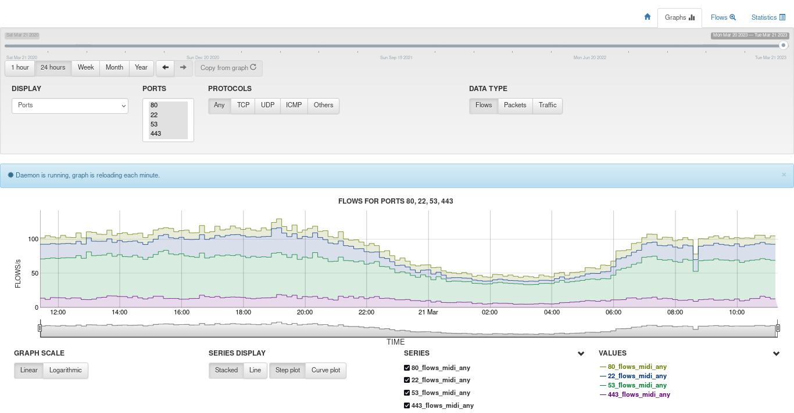

# nfsen-ng-docker

Docker setup for running nfsen-ng (NetFlow visualizer) and nfdump (NetFlow/SFlow/IPFIX collector) together with support for mutiple sources.

## Installation

1. git pull `https://github.com/deanvry/nfsen-ng-docker.git`
2. edit source.conf
    - a csv style file with format: `device;port;proto`
    - where:
        - `device` is a display name like `my-awesome-router`
        - `port` is a unique value in-between 9000-9099 (depends on your setup)
        - `proto` is sflow or nflow (depends on your device capabilities)
3. bring service up using `docker-compose up -d`
4. browse to `http://server_ip:8080`

## Enable Flow Data Compression

If you want to enable flow data compression, do the following steps:
1. Append `nfdump -z` option (this enable LZO1X-1 compression) in `nfdump/entrypoint.sh`.
2. Recreate nfdump service using `docker-compose --build -d nfsen-ng-docker-nfdump-1`, if you have multiple nfdump service specify them.
3. New nfdump image should be rebuild and container restarted.

## Reference Manual

There is some major changes from nfdump v1.6.22 to v1.7.1. I'm suggesting you to read manual pages.

- [github: nfdump project](https://github.com/phaag/nfdump)
- [manpages: nfcapd backports](https://manpages.debian.org/bullseye-backports/nfdump/nfcapd.1.en.html)
- [manpages: nfcapd stable](https://manpages.debian.org/bullseye/nfdump/nfcapd.1.en.html)
- [manpages: nfexpire](https://manpages.debian.org/bullseye/nfdump/nfexpire.1.en.html)

## Tested with:

- MikroTik RouterOS v6.48.6 long-term
